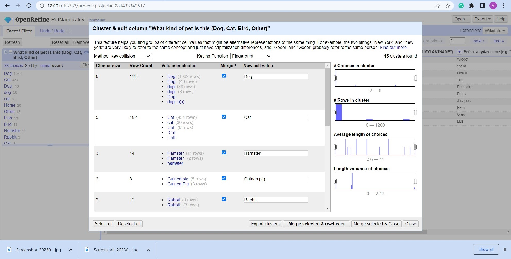
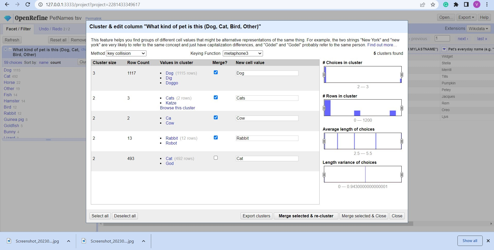
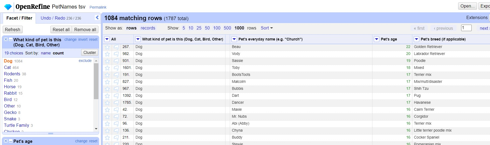

CS 625 Data Visualization
---
HW2 - Data Cleaning

author: Vikas Chhillar

---


CS 625, Spring 2023


### Part-1: Cleaning the data.

The **pets** dataset consists of **1783 rows and the 6 columns**:

- All
- What kind of pet
- Pets full name
- Pets every day name 
- Pets Age
- Pets Breed

After looking the data I realized that data is very messy.
**Some of the errors** in the dataset are:

- Redundancy due to multiple Names
- data is not case sensitive
- unknown extra symbols
- numbers saved as text entry
- numerous spelling mistakes
- and many many more

For cleaning the dataset. I used various techniques which I learnt from the class and also I used some techniques which I searched on the internet.

### Some of the techniques I used for cleaning the dataset###
- facet --> text facet
- facet --> numeric facet
- Cluster & edit column
- Custom text transform using GREL
- Value.replace function using GREL
- sort column with numbers (ascending / descending order)
- and finally some manual editing. 


####  (Cluster and Edit)
First of all i used **text facet** to get order of **what kind of pet** column. because it is showing 83 choices for kind of pets. I used cluster and edit function to sort out all the columns using both the method
-key collision
-Nearest neighborhood


  Key collision method is used with key function fingerprint to sort out similar values with spelling mistakes.



  Here keying function **metaphone 3** is used to sort out the dataset entities of *kind of pet* column.  




  Similarly **Beider Morse** key function is used.


  
  After using all the keying function in key collision method.I switched to **Nearest neighbourhood method** to sort out the dataset.


  I used **cluster and edit function** to sort out mostly all the columns. As shown in the image, there are so many different values of golden         retriever. 
  Also there is one Row which has 3 dogs and one cat. So I selected Edit cell.  Then I split one row into 4 rows to get the different entities for all 3 dogs and cat.


#### GREL (General Refine Expression Language) Method 

  I used *GREL method* to get rid of *null values* and put those values into *unknown column*. I used formula
```{p}
if(value==null,"Unknown",value)
```
  
  Later I used different version of this formula to replace other unwanted values. 


  
  There are different types of rodents in the data set. So I saved all of them in one category **rodents**. And specify their breed in the *pets breed* column. Similarly tortoise in the turtle category. 
  Later I used *GREL method* to change the pets breed, in some cases their name is given as guinea pig but breed is unknown. So I changed their breed as guinea pig and all these rodents like rat,guinea pig,hamster,gerbil in one combine category *Rodents* 


  
  I also used manual editing in some cases. like in this one the *age* is specified in the *pets breed* column and *pets age* is shown  *unknown*. Also in some cases *age* is written as *text datatype*. So it is not showing in the numerical faucet in numeric column. They all are showing in the non numeric column. so I edit that part manually for many values.


  Even after using *cluster & edit function* still there are so many  duplicate values mainly in the *pets breed* column. So i did some research and finally find a way to sort that part. When I increased the radius of **leveshtein** of the **nearest neighbor method**. the duplicate values starts appearing for the cluster and edit function.  


  
  In the pets age dataset there are so many errors in the column. There are various symbols,spelling mistakes,age is given in months, weeks, years. So for that first I used a formula in **GREL** to delete all different symbols and various words. For instance  1/2 is changed with 0.5 I saved all the values with years in numeric form. I used *value.replace* to solve this. 


  
  After that I convert values from *week to years* using formula
```{p}
toNumber(value.replace)("weeks","").replace("week","").replace("",""))/52.0
```

  
  After that the values left with month. so I used formula
```{p}
toNumber(value.replace)("months","").replace("month","").replace("mos","").replace("mo",""))/12.0
```


I also figure out some other way to make my work easy like in view column we can collapse unwanted column temporarily to make our work more efficient. Similarly desired column can be collapsed and expand either right or left side, according to user needs.
Finally I downloaded the clean data csv file and history.json file.

# Part-2:


### 1. How many types (kinds) of pets are there?


There are 20 types of pets but in *other* section there are some non relevant things so we can exclude that and also 1 *unknown* entity is there. Therefore we can say there are **18** kinds of pets.


### 2. How many dogs? 

There are **1130 dogs**.


### 3. How many breeds of dogs?

I select *text facet* for *what kind of pet* and then *select dogs* then I select facets -->text facets for pets breed and it is showing 271 breed for dogs.But because there are *29 unknown* breed so I subtract them from the 271. therefore **242 breeds of dog are there** 


### 4. What's the most popular dog breed?

I select *text facet* for *what kind of pet* and then *select dogs* then I select facets -->text facets for pets breed. After selecting sort by count, I got the desired answer. So, **Golden Retriever** is the most popular dog breed.*


### 5. What's the age range of the dogs?

Dog is selected from the kind of pet column. 


Then I sorted pets age column with number and shortest number


 Later pets age column is sorted with largest number.



Therefore **age range of dogs is 0.115 years(Dog name Coop) to 22 years(Dog name Beau)**.  


### 6. What's the age range of the guinea pigs?

  I selected rodents and then guinea pigs in the pets breed text facet. The **age range of Guinea pigs is 1 year to 5 years.**


### 7. What is the oldest pet?

For this i selected the numeric facet for pets age and then selected the right most part of the column, which gives me pet with maximum age. so **Cat name bruce is oldest pet with 24 years of age.**


### 8. Which are more popular, betta fish or goldfish? How many of each?

After selecting fish and then pets breed, we can see that Betta fish are 12 and gold fish are only 9. Hence,**Betta fish are more popular**.


### 9. What's the most popular everyday name for a cat?

After selecting cat and then cat everyday name and then count, **Kitty is the most popular name  with 7 count**.


### 10. What's the most popular full name for a dog?
i did similiar steps like Q9 for this one. **Maggie is the most popular dog with 7 count**.


## References:

Reference [1](https://openrefine.org/docs/manual/grelfunctions#boolean-functions)
Reference [2](https://openrefine.org/docs/manual/grelfunctions#basic-string-modification)
Reference [3](https://openrefine.org/docs/manual/grelfunctions#string-parsing-and-splitting)


