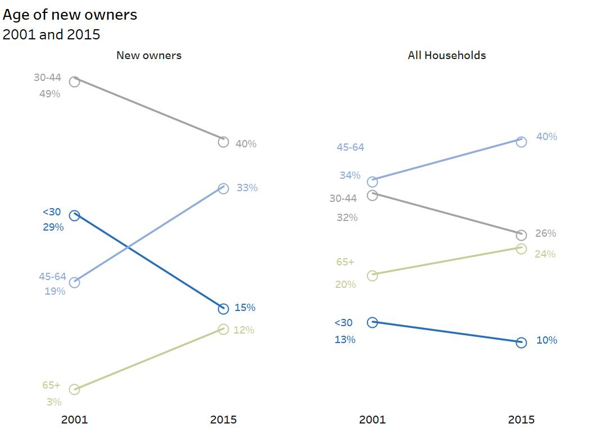

HW 3, CS 625, Spring 2023
================
Vikas Chhillar

CS 625, Spring 2023

---
## Part 1
I used **tableau software** and **slope chart** for this visualization.

Initially I plan to work on **vega lite** for this visualization. I learn about **vegalite** from various online resources, but after spending around 2 days and so many attempts, I was unable to complete the visualization, So finally I shifted to **Tableau**
software for recreating this chart. 

### Original chart ###   

    

   
[Link to the original chart](https://policyviz.com/2017/11/16/remake-stacked-column-chart/)   
   
   
**Here is the image of recreated chart**     
--
      

   
      
      
**Description**

- First of all I download the data file. I tried to create **slope chart** with data provided in the file. but because there were *some undefined values*, so its difficult for me to create a slop chart with those values. For instance *value of year 2001* is labelled as *new owners* but *value of 2015* is *not labelled*. So I labelled them. Moreover its in excel format, So I converted it into **.csv format** to use in **tableau software**.

- After adding the data in the tableau. I opened the Sheet. Afterwards, I added the **type of owner** and **year** in the **columns bar** and the **measure name** and **measure value** in the **rows**. Now I have *four different categories* for **measure values**, So I dragged them all into one to create the *multiple slope chart*.

- Then dragged *measure names* to the *color pane* so all slopes would have different colors. Edited the *years* to get the visualization I wanted. For that I changed the Tick interval and also the fixed start point
-  Deleted the *unrequired values and labels* at both **x and y axis**. Now, to get the *value* of both *measure names and measure values*, I added another *measure value* in the rows and then **dual axis** it.

- The **Marks box** now has *three values*, 
1 All
2 Measure values (with a line chart).
3 Measure values (with a shape).
 
- According to the *required visualization*, the **New owners chart** and the **All household chart** do not need to show *measure names in 2015*.

- For this part of the visualization, I did a lot of hit and trial methods to got the desired result. So for the *measure values with the shape* I added only *measure values* in the *label*  and for the *measure value with the line* I added only *measure names* in the *label*. 

- And then in the **Alignment** part of the *label* I selected **min/ max** value and then I selected *pane in the scope* . And then finally the crucial part where I *selected* the **year in the field** and then I *uncheck* the **label maximum value** so that it will not show on the *year 2015* which is the *maximum value* of the *year* and it is only showing on the **minimum value which is 2001**.
- Then to make it more similar to the original chart I selected all the **grid lines** as none and after that I selected and *edited* the *title* and finally I **positioned** the *measure values* with respect to the original chart.

### Assessment ###

* This idiom is perfect to **compare percentage of people in new owners and all households**.
* The colors selected are not bright enough to visualize the information clearly.
* For any specific category we can easily understand the change of percentage of people because of the *slope chart* between 2001 to 2015

### Goals I cannnot achieve

* I was unable to *hide* the line and circle shape intersection point. And for that I have to disabled the overlap between these two. I tried but somehow was unable to did that. 

---

## Part 2
For this visualization I selected line chart and I used R software to recreate it.

**Image and link to the original chart**    

   
      
      
    
[Link to original chart ](https://camo.githubusercontent.com/ab35ad6cb1bee8c9e3a9a22a8caea8fb7e360ac2e0fdefa79d69e9a78ec54b95/68747470733a2f2f706f6c69637976697a2e636f6d2f77702d636f6e74656e742f75706c6f6164732f323031382f30362f506f6c69637956697a5f555344415f52656d616b655f4c696e655f43686172742e706e67)
    
    
**Here is the image of recreated chart**
    
   
      
      

    
       
       
    
**Description**
- For this visualization, first of all I installed required **library packages**.
1 ggplot2
2 tidyverse.
- I also installed **ggrepel** package which provide *geom for ggplot2 to repel overlapping of text labels* and also the *overlapping of data points*.
- For this visualization I selected **R language in Rstudio software**. For that I *download the data* and  converted into the **CSV format** so that I can use it in *r studio*.
- By looking into the original chart I know that I have to *assign different values of crops in the Y axis* and the *value of years in the x-axis* so I searched for that how to do this in R language. 
- And I learned about two important functions 
1 geomline
2 geomtext
- **Geom line** is used to *create multiple line chart* and **geom text** is used to *define the labels* in the chart
- I used **elemant_blank** function to *delete unrequired information from the axis*. 
- I used **labs** function from *ggplot2* to plot *title and subtitle* to define the findings of the chart.
- After installing all three libraries then I run the *read.csv* function to download a data. after that I used function to define  number of years with defined interval which i searched on the internet.
- Then  I used *geom line* function to define all the crops to create the line chart.
- Also I learned about the *Colors terminology*  in r language and also how to find the **size of the lines** according to the original chart
- Then I use *labs* function to define the *title and subtitle* with the *color* and the different attributes like whether it's *bold or italic*.
- Then I used **Geom text function** to  find the *different labels* of the major crops with respect to their *corresponding axis*.
- Later I also learn about the **check overlap** function so that *different labels should **not overlap each other** for that I put the value of **check_overlap =  true**.
- Later on I added *minimum theme function* to erase *default background template* from the chart.
 

### Assessment 

* The **line chart** did a great job to **visualize the trend of major crops / year**.
* **Color** selection is fair enough to get the **visualization** for different crops.

### Goals I cannot achieve

* I was unable to get the *0 start point in y-axis*. Though I tried multiple times to sort this. 

---
## References
* [1](https://www.r-bloggers.com/2016/12/7-visualizations-you-should-learn-in-r/)
* [2](https://stackoverflow.com/questions/29278153/plotting-with-ggplot2-error-discrete-value-supplied-to-continuous-scale-on-c)
* [3](https://stackoverflow.com/questions/33280191/multiple-line-and-bar-chart-in-ggplot-with-geom-text-and-colours)
* [4](https://stackoverflow.com/questions/33280191/multiple-line-and-bar-chart-in-ggplot-with-geom-text-and-colours)
* [5](https://policyviz.com/2017/11/16/remake-stacked-column-chart/)
* [6](https://policyviz.com/2018/06/07/remake-time-series-column-chart/)
* [7](https://www.youtube.com/watch?v=SOgQMcUcv8o)
* [8](https://www.geeksforgeeks.org/remove-axis-labels-and-ticks-in-ggplot2-plot-in-r/)
* [9](https://www.youtube.com/watch?v=NN5W_83N4Z4) 
---
