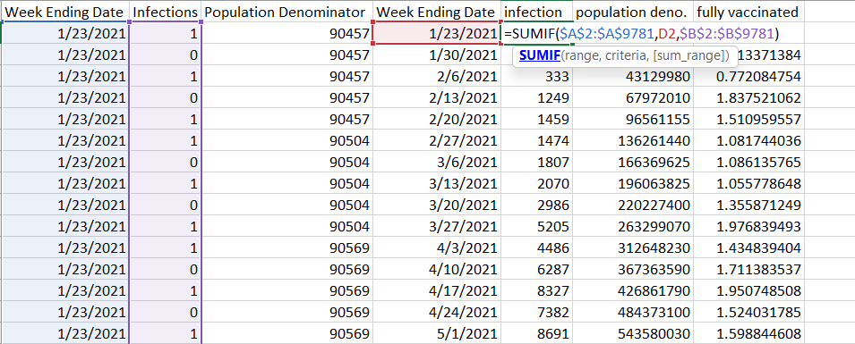
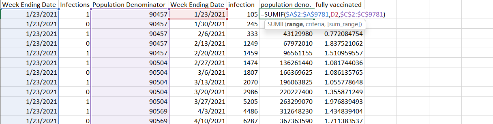
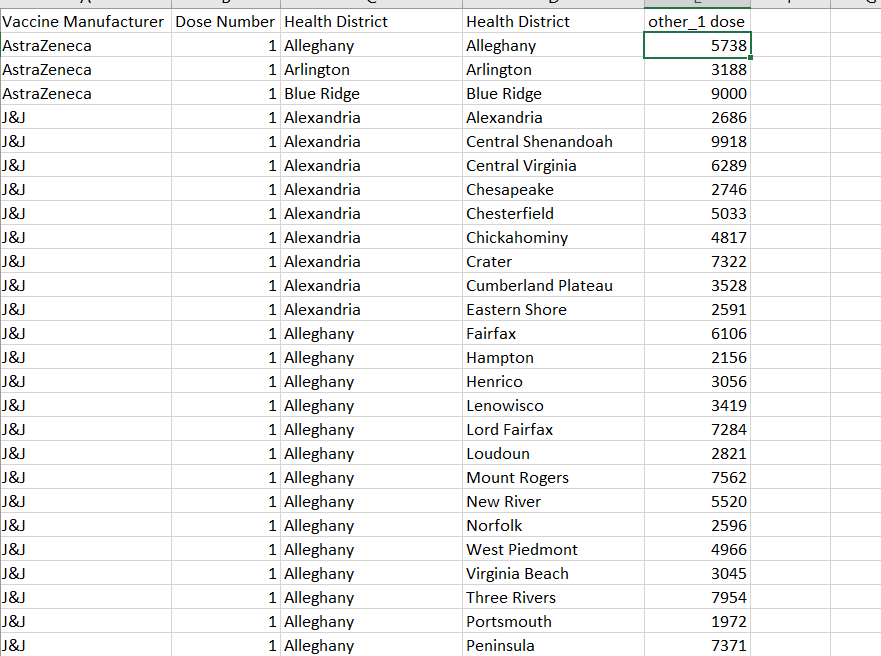

HW 4, CS 625, Spring 2023
================
Vikas Chhillar

CS 625, Spring 2023

---
## Software used for this assignment

For this Assignment, I used tableau and excel software for viewing and filtering,sorted the data.

## Part 1

“How has the weekly rate of COVID-19 cases in Virginia changed over time
based on vaccination status?”

Firstly I download the data and then after looking into the data 


The columns were not in a readable manner. All of them are intermingled. So I selected whole data with **ctrl+A**, then I used the shortcut key **Alt + H O I**. This shortcut saved a lot of my time. Because now I don`t have to manually adjust the columns. 


I decided to first of all sorting the ending week of the date using excel.
Then I use filter on the vaccination status and I selected the filter to display fully vaccinated records only

-    I created 3 separate sheets.
1    Fully vaccinated
2    Partially vaccinated
3    Unvaccinated

-   For fully vaccinated data. I Selected the columns of **Week Ending Date**, **Case** and
    **Population Denominator**,
-   I Copied the *Week Ending Date,case,Population denominator* column to fully vaccinated sheet. 
-	I Removed the duplicates from the dataset by using remove duplicate filter. I got total 78 dates.


 
-   Then I used the **SUMIF** formula to get the desired result. This formula will sum all the cases of Fully vaccinated people on a particular date.


-	After that I used the same formula for the Population denominator. I just change population denominator in place of infections.



-   Later for the final answer, I used the formula which is given in the read me file
        **rate_per_100k = (cases /
    population_denominator) \* 100000**
    
    
    
After that I created new sheets for partially vaccinated and unvaccinated data. I used the same process for the partially vaccinated and the unvaccinated people's record.
Then I created a new Excel file for the visualization with final dataset.
-   Then I created a new column name named as **Week** to show the week number in the visualization.
	i learned about a formula ```=row()-1```. It will sort out the list, incase if any row is deleted from the dataset.


My final dataset used for creating the chart:


### Creating Chart

-    I converted the excel file into .CSV file so that I can use it into the **tableau software** I put the week column into the columns pane and fully vaccinated, partially vaccinated and unvaccinated into the rows pane.
-   then I dragged the partially vaccinated and unvaccinated from rows pane into the Y axis to create a multiple line chart,conta containing values of all the three types of vaccination status
-   I selected the **line** chart in marks. 
-   I selected the **line chart** as an **idiom** because it is the most effective idiom for showing the various trends. 
-   I added the measure names in the color palette. And then edit the colors to get the desired output 
-   I edited the label of x-axis Y axis and title to get the proper visualization in the chart


1.  **Marks**   Line
2.  **Attributes** : Rate of Infected Cases (Quantitative
    attribute), Number of weeks (Ordered key attribute)
3.  **Channels**: Vertical Positions, Hue


#### Observations

1.  Unvaccinated peoples have maximum probability to get infected by the Covid 19.
2.  Fully vaccinated peoples are least prone to the infections
3.  At the peak level of infection, fully vaccinated people have least numbers to get infected with covid 19.  
4.  Even partially vaccinated people were also have very minimum chances of infection with comparison of unvaccinated people.


## Part 2

### The Question

“For each health district in Virginia, what proportion of all 1st doses
were of the Pfizer vaccine?”

### The main attributes used

1.  **Health District**: Health district name assigned by the Virginia
    Department of Health. There are 35 health districts in Virginia.
2.  **Vaccine Manufacturer**: Name of the manufacturing company that
    produced the vaccine.
3.  **Dose Number**: Dose number for the person who is administered the
    vaccine.

### Manipulations Performed

I performed the following manipulations on the **2nd dataset** in the
following order:

First of all I used the shortcut key **Alt + H O I** to fixed column width. 
-   Then I filter the not reported and out of state from the FIPS column
 

 
-   I also filter the **non-specified** from the vaccine manufacturer. 

-   Now according to question to get proportion of Pfizer vaccine for the first doses,I **filtered dose number** to value 1, so that i can get the data about the **first doses** only.
-   After that I filter all the other vaccine manufacturers from the column so that I can get value of only Pfizer vaccine.
-   Then I created two separate sheets.
    For pfizer,I added the vaccine manufacturer column,DOS number column and health District column
 -  Later on I remove all the duplicate values in the whole district column 
 -  there were total 35 unique district.
 -  Then I use the SUMIF function to get the first dose value for Pfizer vaccine.
 
 

-   Similarly for other vaccines, I included all the other vaccines except  Pfizer in the vaccine manufacturer column.
-   Then I added the value of other vaccines manufacture,first dose and health districts in a new sheet.
-   I use the SUMIF function to get the value for the first dose for other vaccines.



-   After that I added values of both pfizer and other vaccines and get the percentage value of both vaccines in the final data.

 

-   Then convert final dataset to .csv file to use for visualization.


### Creating Chart

-   I converted the excel file into .CSV file so that I can use it into the **tableau software** 
-   I placed the **health district** column into the **rows** and **measured values of Pfizer and other vaccines** into the **column** pane.
-   I selected the **bar** chart in marks. Because there are **percentage values** for **Pfizer** and **other** vaccines, A **stacked bar** chart looks visually appealing for this dataset. 
-   I selected the **stack bar** chart as an **idiom** because it is the most effective idiom for showing the various trends. 
-   I added the measure names in the color palette. And then edit the colors to get the desired output 
-   I edited the label of x-axis Y axis and title to get the proper visualization in the chart


1.  **Marks**  Bar chart
2.  **Attributes** : percentage of first dose of vaccine which is a quantitative value attribute, 
    health district(Ordered key attribute)
3.  **Channels**: Color, length 


-   I edited the colors for Others and Pfizer vaccine and also I added measure values into the label so that the percentage can be shown on the chart.
-   I edited the title, X axis and Y axis labels

### Observations

According to the data set and the visualization it's not necessary that Pfizer vaccines are much in demand. as compared to other vaccines
-   Also there is not any certain or defined pattern, that Pfizer is used in most of the districts. Infact there is a quite balance approach between the use of vaccines of Pfizer and others

## Part 3

### The Task

Propose two questions that require data from dataset 1 and dataset 2 to
be combined to answer. Describe what data manipulation would need to be
done to answer each question. Sketch a chart that could be used the
answer each question. Justify your visualization idiom choice.

## Part 3 Question 1

Proposed question: Which region of Virginia has maximum number of vaccinated people


### How Dataset 1 and 2 are combined

I combined the two datasets using the **Health Region** attribute in the
1st set and **Health District** attribute in the 2nd set.

For this task, I worked with the following attributes from the given
datasets:

1.  Dataset 1

-   The **Health Region**: The health region assigned by Virginia
    Department of Health. Values include: Central Region, Eastern
    Region, Northern Region, Northwest Region, Southwest Region.

2.  Dataset 2

-   The **Health district**: name of the district

-   **Dose number** : Count of People with 1st dose from the selected Health district 

-   The **Vaccine Manufacturer**: Name of the manufacturing company that
    produced the vaccine.

### Manipulations Performed

To answer the questions I  used Virginia health regions, districts, and localities pdf which was provided with
the assignment . I used it to assign the districts to their respective
regions by using **filters**
-   first I selected the region from the Virginia health regional pdf.
-   Then I selected the districts which are in a particular region from the health district column.
-   Later on I filter the dose number is equal to one so that I can get the data of all the peoples who got atleast one dose of the vaccination
-   finally I got the final dataset for the visualization. 
-    Then I created a new sheet with all the regions and then added the total number of dose number for every region, which I initially got from the filter of health District.
-   then I got a total number of vaccinated peoples for all different regions


### Creating Chart

I converted the excel file into .CSV file so that I can use it into the **tableau software** 
-   I placed the **regions** column into the **columns** pane and ** total number of vaccinated people** into the **rows** pane.
-   I selected the **bar** chart in marks. Because bar chart can easily defined the difference between the number of vaccinated people of different regions.
-   I selected the **bar** chart as an **idiom** because it is the most effective idiom for showing the various trends. 
-   I added the regions in the color palette. And then edit the colors to get the desired output 
-   I added the Measure values into the label palette.
-   I edited the label palette to get the similar color of label according to bar chart.
-   Then I sort out the regions in a descending order with respect to total number of vaccinated people.
-   After that I edited x-axis,y-axis and the title.


-   **Marks Used**: bar chart
-   **Attributes used**: Total number of vaccinated people(quantitative)regions()
-   **Channels used**: Horizontal positions, color


### Obeservations/Insights

-   The number of vaccinated people in northern region were less in comparison of other four regions.
-   The central region and the northwest region were equally distributed with respect to the number of vaccinated people.
-   There is a probability that the infection rate in the northern region could be highest.


## Part 3 Question 2

Proposed question: Region with maximum number of vaccine doses administered count”

### How Dataset 1 and 2 are combined

### Main attributes used

1.  **Health Region**: The health region assigned by Virginia Department
    of Health. Values include: Central Region, Eastern Region, Northern
    Region, Northwest Region, Southwest Region.
2.  **Vaccine Doses Administered Count**: Total number of vaccine doses
    administered.

### Manipulations Performed

To answer the questions I again used Virginia health regions, districts, and localities pdf which was provided with
the assignment . I used it to assign the districts to their respective
regions by using **filter** in the health district.
-   first I selected the region from the Virginia health regional pdf.
-   Then I selected the districts which are in a particular region from the health district column.
-   Later on I filter the vaccine doses administered count in a specific region.
-   I get administered count of vaccine doses for all the regions. 
-   finally I got the final dataset for the visualization. 
-   Then I created a new sheet with all the regions and then added the vaccine doses administered count for every region.
-   Then I used the sum formula in excel to get the desired result. 


### Creating Chart

I converted the excel file into .CSV file so that I can use it into the **tableau software** 
-   I placed the **regions** column into the **columns** pane and ** vaccine doses administered count** into the **rows** pane.
-   I selected the **bar** chart in marks. Because bar chart can easily defined the difference between the vaccine doses administered count of different regions.
-   I selected the **bar** chart as an **idiom** because it is the most effective idiom for showing the various trends. 
-   I added the regions in the color palette. And then edit the colors to get the desired output
-   I added the sum of vaccine doses administered count in the shape palette. Now the shape Channel visualizing the total number of vaccine doses administered count in every region. 
-   I added the Measure values into the label palette.
-   I edited the label palette to get the similar color of label according to bar chart.
-   Then I sort out the regions in a ascending order with respect to vaccine doses administered count.
-   After that I edited x-axis,y-axis and the title.


-   **Marks Used**: bar chart, line
-   **Attributes used**: vaccine doses administered count(quantitative value attribute)regions(categorical key attribute)
-   **Channels used**: vertical positions, color, labels


### Obeservations/Insights

-   The number of vaccine doses administered count in northern region were highest in comparison of other four regions.
-   The Southwest region and the northwest region were quite close in terms of vaccine doses administered count.
-   Northern region has administered the most vaccines compared to the other regions. And Northwest region has administrate the lowest number of vaccine doses count. 

## References

-   <https://www.vdh.virginia.gov/content/uploads/sites/182/2020/08/VA-regions_districts_localities.pdf>
-   <https://data.virginia.gov/dataset/VDH-COVID-19-PublicUseDataset-Cases-by-Vaccination/vsrk-d6hx>
-   <https://data.virginia.gov/Government/VDH-COVID-19-PublicUseDataset-Vaccines-DosesAdmini/28k2-x2rj>
- 
