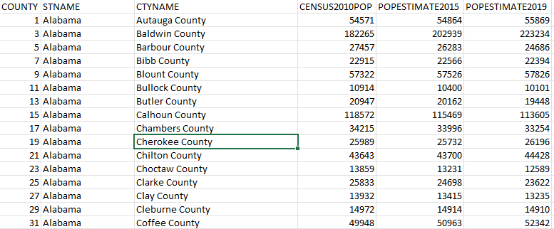

HW 5 Analyzing Data Using Distribution Charts
================
Vikas Chhillar

CS 625, Spring 2023


## Software used for this assignment

For this Assignment, I used **R studio** for creating boxplot,eCDF and histogram.
and **excel software** for viewing and filtering,sorted the data.

## Part 1.
### Working on dataset

The **columns were not in a readable manner**. All of them are intermingled. So I **selected whole data** with **ctrl+A**, then I used the shortcut key ```Alt + H O I```. This shortcut saved a lot of my time. Because now I don`t have to manually adjust the columns. 

I used first data set for this homework.
Firstly I **download the data**.Then after looking into the data,I found a similarity in the  data.  I use **filter** on the county column and I selected the filter to **display county with 0 value for every state**. 
so I  i analysed that  first county of of every state has similar name as of state.And these are unwanted outliers in the dataset

So I calculated and found that first county of every state is actually the total sum of all counties population together in that state. I used Delaware state to show this analysis. 


So first I filtered out all these counties.


Now I have total 3143 entities.
and then created a new sheet with required columns according to question.


 and then after getting the refined data. I used **R** in Rstudio for visualization.
 
### Creating Visualization 
 
-I used class lecture and some online search to learn about how to create boxplt,eCDF and histogram in R. 
**Boxplot**
-Firstly I imported the required libraries for the visualization.
-Used read.csv function to download data to the Rstudio
-I used data.frame to get three glyphs for the three columns 
-To get all glyphs in a single chart i used rbind function
-The population values are very big, so I find the exponential values as a solution for this problem. 
-x and y axis are properly labelled and also different color pallets used to make visualization effective.

Code snippet for box plot

```
# Required libraries 
library(ggplot2) 
library(tidyverse)
library(scales)

# i used read.csv to link csv file 
censusdata <- read.csv(file.choose(), header=T)

# This wil show the dataset structure. 
head(censusdata)

# I used data.frame to get three glyphs for the three columns 
CENSUS2010POP = data.frame(glyphs='CENSUS2010POP', value=censusdata$CENSUS2010POP) 
POPESTIMATE2015 = data.frame(glyphs = 'POPESTIMATE2015', value=censusdata$POPESTIMATE2015)
POPESTIMATE2019 = data.frame(glyphs = 'POPESTIMATE2019', value=censusdata$POPESTIMATE2019)                   
# To get all glyphs in a single chart i used rbind function
plot.data = rbind(CENSUS2010POP, POPESTIMATE2015, POPESTIMATE2019) 

# labelling of both X and Y axis
Box_glyphs<- ggplot(plot.data, aes(x=glyphs, y=value, fill=glyphs))+geom_boxplot()+
labs(x = " Separate boxplot glyphs in single chart",y = "Population distribution of all counties")+
  
#seting themes and colors for the visualization  
  theme_bw()+
  theme(legend.position = "none")+
  scale_fill_brewer(palette="Dark1")+
  
# using log10 to get exponential value in Y axis. So that visualization is easy to perform. 
scale_y_continuous(trans = log10_trans(),
                     breaks = trans_breaks("log10", function(x) 10^x),
                     labels =trans_format("log10",math_format(10^.x)))+
  
  labs(title = 'Census of 2010 with estimated population distribution in 2015 and 2019')+
  theme(plot.title = element_text(face = "bold"))

print(Box_glyphs) 
```


#### Observation

1. By looking into the boxplot chart, all three glyphs with different data, showing quite similiar population distribution.
2. There is a slight difference in th epopulation distribution of 2015 and 2019 between 10^2 -10^3. there is one extra outlier in 2019 population distribution.
3.Majority of outliers are present in the counties with maximum population distribution.
4. The median value in all 3 glyphs is quite similar so we can assume that there is approximately equal distribution between the high and low population counties
5.The outliers in the lower distribution (between 10^2 - 10^3) in estimated population distribution of both 2015 and 2019 is different from the cencus 2010.
6. Also the outliers in lower distribution is periodically increasing with respect to time. 
7. Boxplot can give a summarized view of the distribution.In other words, it can give an idea about the whole data. Also for more precise visualization we can use some other variants of box plot also. 

---
**eCDF**
-eCDF is Empirical cumulative distribution function 
-It provides an alternative visualization of distribution.
-For this visualization I used the CENSUS2010POP column for the distribution of the population of all counties in the US as of the 2010 Census.  
-The geom parameter of the stat_ecdf() function can be used to change the shape of the ECDF plot. We can add any shape as the value of parameter geom. For example, we can have a point-shaped ECDF plot made using stat_ecdf() function with the geom parameter being “point”
-I used the similar log 10 function to visualize the population range. 
-For x and y axis are properly labelled and also different color pallets used to make visualization effective.


Code snippet for eCDF 
```
eCDF<-ggplot(censusdata, aes(CENSUS2010POP))+stat_ecdf(geom="point", pad=FALSE, color="cyan")+
  
  labs(x = "Distribution of the population of all counties",y = "Range",face =c("plain"), inherit.aes = FALSE)+theme_bw()+
  
  scale_x_continuous(trans = log10_trans(),breaks = trans_breaks("log10", function(x) 10^x),labels = trans_format("log10", math_format(10^.x)))+
  
  labs(title = 'Distribution of the population of all counties in 2010 Census')+theme(plot.title = element_text(face = "bold"))

print(eCDF)

```    


#### Observation
1.  This graph displays the data points from lowest to highest against their percentile range.
2. Between 10^2 to 10^3 there are many outliers and population distribution is not dense.That`s why there is so much white space between data points.
3. The population distribution between 10^4 and 10^6 is more dense because in this area the curve is quite strong. that means there are so many data points or we can say population distribution is high in this zone. 
4. The reason cureve is quite dense here is because I used log 10 value for the population distribution. So the distribution is compressed because of exponent of 10 scale.The curve is quite smooth as there are a lot of values that are compressed by the log10 scale. And also the main reason for using the exponential value is because the range of the values is enormous.
5. The eCDF curve is massively change its course of motion betwen 10^4 to 10^6. which implies it is the zone of median. and majority of the population distribution is in this zone


**Histogram**
Histogram visualise the distribution of a single continuous variable by dividing the x axis into bins and counting the number of observations in each bin

- For this visualization I used the CENSUS2010POP column for the distribution of the population of all counties in the US as of the 2010 Census.
- I used geom_histogram() to display the counts with bars.
-  Bin size is 0.5 to get a normalize chart for the visualization.

- The population values are very big, so I used the similar log 10 function to visualize the population range.  
- x and y axis are properly labelled and also different color pallets used to make visualization effective.
- For x and y axis are properly labelled and also different color pallets used to make visualization effective.

Code snippet for Histogram
```
HSGM_vis<-ggplot(censusdata, aes(x=CENSUS2010POP))+theme_bw()+geom_histogram(binwidth=0.5,color="grey", fill="seagreen")+
  
  scale_x_continuous(trans = log10_trans(),breaks = trans_breaks("log10", function(x) 10^x),labels = trans_format("log10", math_format(10^.x)))+
  
  labs(x = "bins",y = "Distribution of population of all counties",face =c("plain"))+labs(title = 'Distribution of population of all counties in 2010 Census')+theme(plot.title = element_text(face = "bold"))

print(HSGM_vis)

```


#### Observation

1. Histogram is a type of bar chart that shows the frequency or number of observations within different numerical ranges, called bins. The bins are usually specified as consecutive, non-overlapping intervals of a variable.
2. Now by looking at the histogram, it is quite evident that maximum population distribution is near the median as it is in the boxplot and the eCDF. 
3. It is quite easy to identify the highest frequency in the histogram because bins can easily visualize that.
4. For instance there is a spike in the distribution of population in the bin at 10^4. and after that maximum distribution at the median, there is a gradual decrease in the distribution.
5. Histogram is based on bin size. so the variation in the bin width can alter the result. so its is not a perfect visualization for comparison.
6. For instance if binwidth is reduced, then the resulting visualization is significantly different from the previous one.
7.Histograms are not robust to outliers or changes in variable’s maximum and minimum.


## Part 2

For further investigation I used histogram from part 1.
- As we discussed if we changed the binwidth, the resulting visualization is significantly distorted. So I changed binwidth to 0.1 to see the smaller details of the dataset.
- Now after decreasing the binwidth the visualization is remarkably improved.
- Now its quite easy to identify  outliers in the histogram.
- In the previous visualization with binwidth 0.5, there is a spike in distribution at  10^4 bin zone  but in this visualization, we can see its a gradual increase in the population distribution.
- Similarly after the median we can identify certain outliers between 10^4 - 10^5 in this visualization which are unable to detect in the previous one.


I created one more chart with binwidth 0.9 and again the visualization is changed with respect to bin.
Now its looks like that the population distribution is maximum at the median and there is a steep decline in the distribution after the median.
So we can say that they can be useful for visualizing the distribution of continuous, discrete or even unordered data. However, they also has some drawbacks like they are too much dependent on the number and position of bins, which can affect the appearance and interpretation of the graph.

*Code snippet for Histogram with bin size 0.1*
```
HSGM_vis<-ggplot(censusdata, aes(x=CENSUS2010POP))+theme_bw()+geom_histogram(binwidth=0.1,color="grey", fill="orange")+
  
  scale_x_continuous(trans = log10_trans(),breaks = trans_breaks("log10", function(x) 10^x),labels = trans_format("log10", math_format(10^.x)))+
  
  labs(x = "bins",y = "Distribution of the population of all counties",face =c("plain"))+labs(title = 'Distribution of the population of all counties in 2010 Census')+theme(plot.title = element_text(face = "bold"))

print(HSGM_vis)

```


*Histogram with bin size 0.9*

```
HSTGM_vis<-ggplot(censusdata, aes(x=CENSUS2010POP))+theme_bw()+geom_histogram(binwidth=0.9,color="grey", fill="orange")+
  
  scale_x_continuous(trans = log10_trans(),breaks = trans_breaks("log10", function(x) 10^x),labels = trans_format("log10", math_format(10^.x)))+
  
  labs(x = "bins",y = "Distribution of the population of all counties",face =c("plain"))+labs(title = 'Distribution of the population of all counties in 2010 Census')+theme(plot.title = element_text(face = "bold"))

print(HSTGM_vis)

```

#### Observation

---     
## References

-   [1](https://www.vdh.virginia.gov/content/uploads/sites/182/2020/08/VA-regions_districts_localities.pdf)
-   [2](https://ggplot2.tidyverse.org/reference/geom_boxplot.html?q=boxplot#null)
-   [3](https://ggplot2.tidyverse.org/reference/geom_histogram.html?q=histogram#null)
-   [4](https://ggplot2.tidyverse.org/reference/stat_ecdf.html?q=eCDF#ref-examples?q=histigram#undefined?q=histgram#undefined)
-   [5](https://www.youtube.com/watch?v=iI8RA6fjxNg)
-   [6](https://data.virginia.gov/dataset/VDH-COVID-19-PublicUseDataset-Cases-by-Vaccination/vsrk-d6hx)
-   [7](https://www.youtube.com/watch?v=Xe4U_-o_EWw)
-   [8](https://data.virginia.gov/Government/VDH-COVID-19-PublicUseDataset-Vaccines-DosesAdmini/28k2-x2rj)
-   [9](https://wisdomanswer.com/what-is-the-advantages-and-disadvantages-of-histogram/)
-   [10](https://towardsdatascience.com/6-reasons-why-you-should-stop-using-histograms-and-which-plot-you-should-use-instead-31f937a0a81c)
