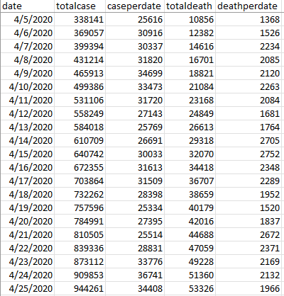

HW 6  Project - Initial Dataset Exploration
================
Vikas Chhillar

CS 625, Spring 2023

## Software used for this assignment.
   
For this Assignment, I used **Tableau online** for creating visualization.
and **excel software** for viewing and filtering, sorted the data.

## STEP 1.

### About Data

**COVID-19** is an infectious disease caused by the **SARS-CoV-2 virus**. It affects the human respiratory system, making breathing difficult. It’s a contagious disease that has spread across the world like wildfire. The virus was initially discovered in **Wuhan, China, in 2019**. The pandemic has affected millions of people worldwide, who are either sick or have died due to the spread of this disease    
COVID-19 has affected people’s lives in many ways, from social distancing to lockdowns and quarantines. It has also affected the **global economy and stock market and even change the way people communicate**. By comparing COVID-19 datasets with other datasets related to global economic data or air quality index data, you can gain insights into how COVID-19 has affected these areas.    

Due to the significant impact of COVID-19 on every aspect of human society, there are many sectors that have been completely disrupted. As a result, COVID-19 historical data is an excellent dataset for visualizing the changes in different aspects of society.    

For the **initial exploration**, I have selected the **Coronavirus (COVID-19) Data in the United States from the New York Times repository (https://github.com/nytimes/covid-19-data)**. I am using this dataset to explore interesting insights and **plan to add multiple datasets to this COVID-19 data**.

### Choose a dataset
**Dataset Selected** :  Coronavirus (Covid-19) Data in the United States, New York Times - https://github.com/nytimes/covid-19-data.
---    

This dataset contains **1159 rows and 3 columns.** 
- Date ( From 21st january 2020 to 23rd january 2023 ) 
- Cases (Total number of cases)
- Death. (Total number of death)      
     
     

## Step 2: Start the EDA Process
**Exploratory Data Analysis (EDA)** is an important step in any data analysis or data science project. EDA is the process of **investigating the dataset to discover patterns and anomalies (outliers) and form hypotheses based on our understanding of the dataset**. EDA involves generating summary statistics for numerical data in the dataset and creating various graphical representations to understand the data better. The goal of EDA is to maximize insights into a dataset.

After analyzing the data, I determined that for the **initial visualization**, I needed the **total number of cases and total number of deaths per day**. To achieve this, I used a **formula in Microsoft Excel** and **added two new columns** to the main dataset

- Case per date
- Death per date

**I freeze the title pane of my dataset’s first row containing the names of all columns. This way, I can still keep track of the title of my column while scrolling through the dataset**.    

Now the first question that comes to mind is:     

**Q1. What are the total number of cases and total number of deaths?**    

   Total case till March 2023 = 103,910,034    
   
   Total Covid deaths till march 2023 = 1,128,090

Because the dataset is quite big, I converted the **date into months in Tableau** for better visualization.    

     

**Q2. On which date was the highest number of COVID-19 cases reported in a single day?
    On 10 january 2022, there were 1433977 covid infection cases.** 

**Q3. On which date was the highest number of COVID-19 deaths reported in a single day?
    On 11 november 2022, 12718 peoples were dead due to covid 19.**
    
    
    
    
    
While analyzing the dataset, I **found some negative values** such as -2435 which **appear to be mistakes in the dataset**. these errors are visible in the negative side of X axis in the visualization. Upon further investigation, I found that there were **errors in four rows**, specifically rows 502, 785, 993, and 1148.

Now after the initial analysis and answering the questions.
    
    
### final two questions are 

## 1. Does the incidence of COVID-19 infections vary with different seasons?     

 

 
### Creating Visualization in Tableau 
---    
- Downloaded the **maindata.csv** file for visualization purposes.
- Converted the **date into months** to improve visualization.
- **Summarized the date into months** in the visualization to obtain the total number of cases and deaths of the complete dataset in a **specific month**.
- Annotated the marks with the highest and lowest value and matched the annotation color with the charts.
- Used **dual axis** for better visualization and repeated the steps done before.
- Used **line charts** for total death per month.
- Used **bar charts** for total cases per month.
- Annotated the **marks** with matching color of the chart.
- Labeled the **X and Y axis**.
- Wrote a **title and subtitle** for the visualization.
    
    
 
    
    
#### Observation
---
After analyzing the data, I can **conclude** that the number of COVID **infections and deaths increased during the winter season and gradually decreased with the summer season.** Moreover, COVID infections and deaths are at their **lowest during the summer season**. Therefore, we can say that COVID cases are **more prominent** during the **winter season** than the summer season. This finding is consistent with previous studies that have shown that **respiratory viruses** such as COVID-19 are more **prevalent during the winter months** due to factors such as **low humidity levels and cold temperatures**.

## 2. Is there a direct correlation between the rise in COVID-19 cases and the rise in deaths of infected individuals?

 

### Creating Visualization in Tableau 
---   

- Downloaded the **maindata.csv** file for visualization purposes.
- Converted the **date into months** to improve visualization.
- Used **months** data on the **x-axis** to make visualization feasible because date data is very large.
- Used **bar charts to visualize cases per month** from 2020 to 2023.
- Used bar charts to visualize **COVID deaths per month** from 2020 to 2023.
- **Annotated** the marks with the highest COVID cases and the correlated COVID deaths in that area.
- Annotated the highest COVID death and the correlated COVID cases in that area.
- Used **color to differentiate different years** within the charts.
- Defined the **legends (Year of date)**.
- Used **dual axis** for better visualization and repeated the steps done before.
- Used **line charts** for total death per month.
- Used **bar charts** for total cases per month.
- Annotated the **marks** with matching color of the chart.
- Labeled the **X and Y axis**.
- Wrote a **title and subtitle** for the visualization.

 
#### Observation
---  

As we can see in the visualization that in **january, 2021  covid cases were 6,196,874 and covid deaths were 95,249.** but in **january 2022 covid cases were increases to 20,300,128** but the **covid deaths reduced to 61,607**. This can be because **people developed immunity following covid 19 vaccine or natural infection**. So We can assume that **there is no direct correlation** between the rise in COVID-19 cases and the rise in deaths of infected individuals. While there is a correlation between the two, it is **not a direct one**. The severity of COVID-19 cases can **vary greatly**, and some people may experience mild symptoms while others may experience severe symptoms that can lead to death. Additionally, there are **many factors that can contribute to the severity of COVID-19 cases, including age, underlying health conditions, and access to healthcare**. A person can develop immunity from COVID-19 following vaccination, natural infection, or a combination of both. **The immune system produces antibodies in response to the SARS-CoV-2 virus or COVID-19 vaccines**. A new report shows that 90% of people who recover from COVID-19 infections keep a stable overall antibody response.

---     
## References

-   [1](https://github.com/nytimes/covid-19-data)
-   [2](https://coronavirus.jhu.edu/)
-   [3](https://www.cdc.gov/)
-   [4](https://www.who.int/health-topics/coronavirus#tab=tab_1)
-   [5](https://www.youtube.com/shorts/VzYdVbFT3aY)
-   [6](https://data.virginia.gov/dataset/VDH-COVID-19-PublicUseDataset-Cases-by-Vaccination/vsrk-d6hx)
-   [7](https://www.youtube.com/shorts/VzYdVbFT3aY)
-   [8](https://www.theguardian.com/world/2022/jun/14/people-who-caught-covid-in-first-wave-get-no-immune-boost-from-omicron)
-   [9](https://help.tableau.com/current/online/en-us/web_author.htm?source=productlink)
-   [10](https://www.youtube.com/watch?v=z4mLwELziNg)
