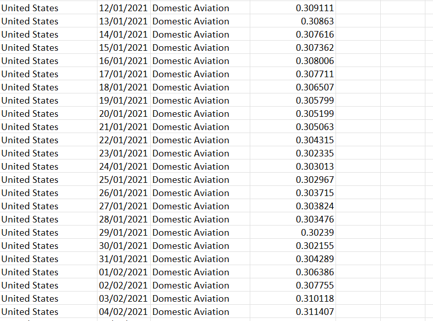
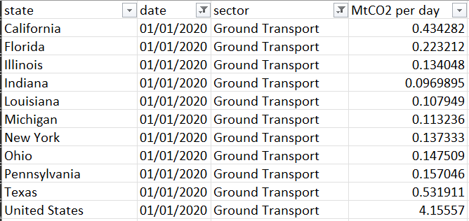
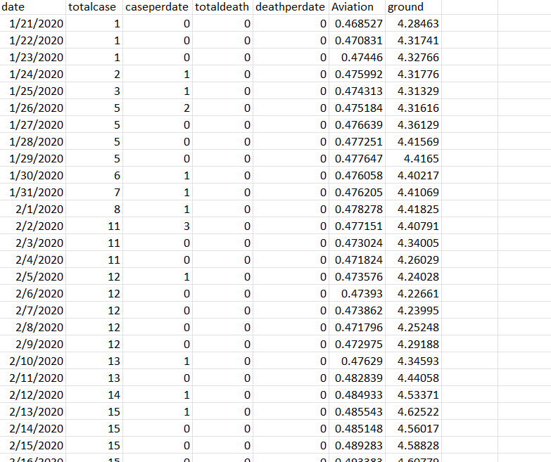
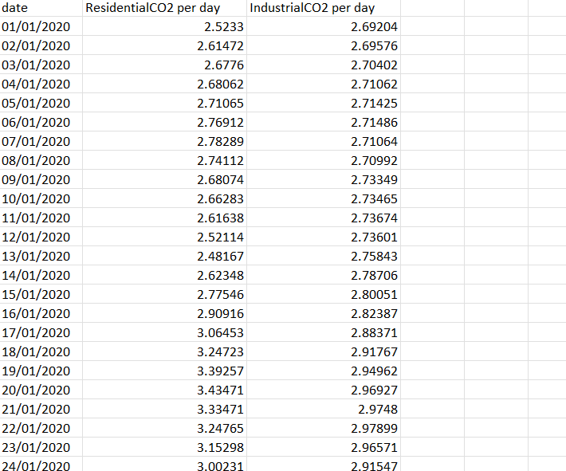
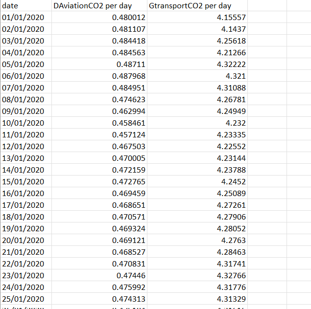
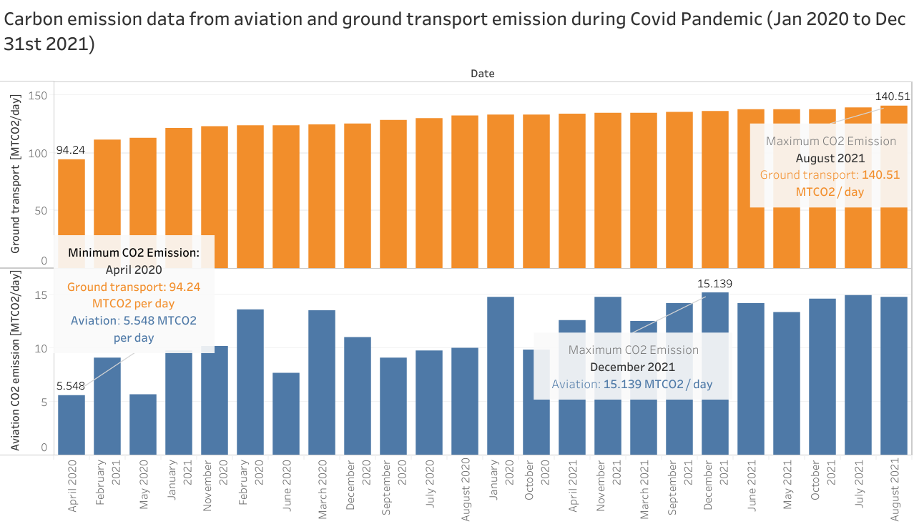
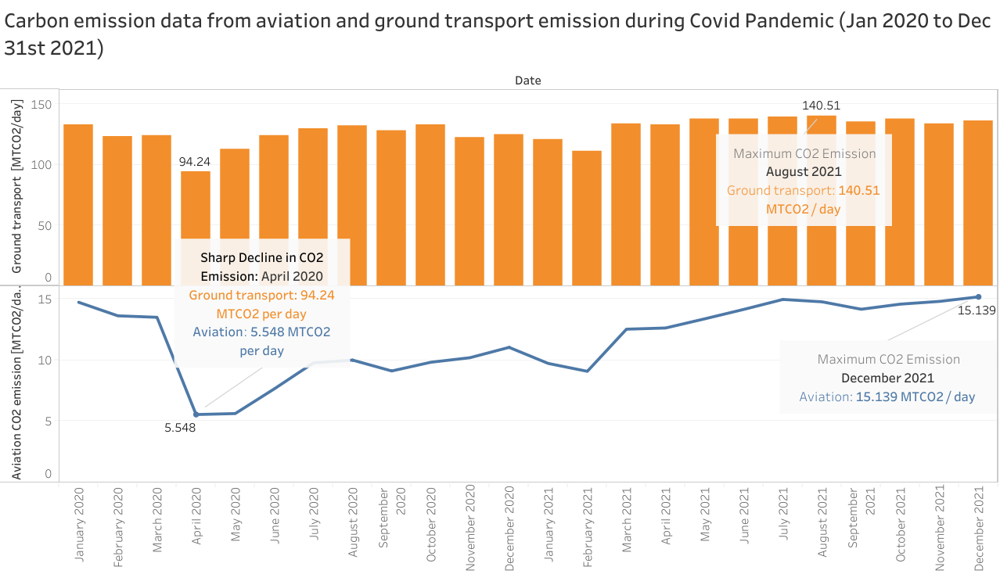
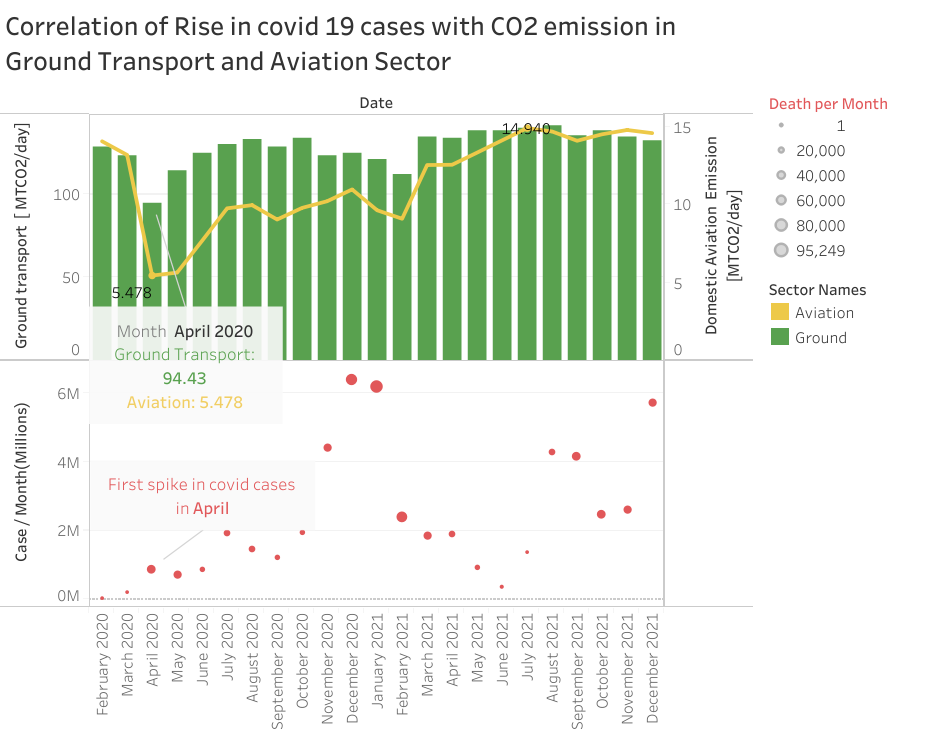
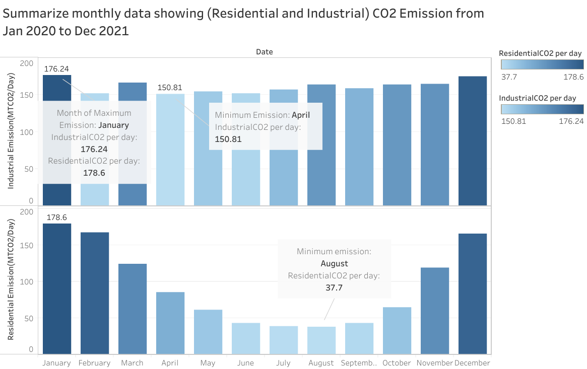
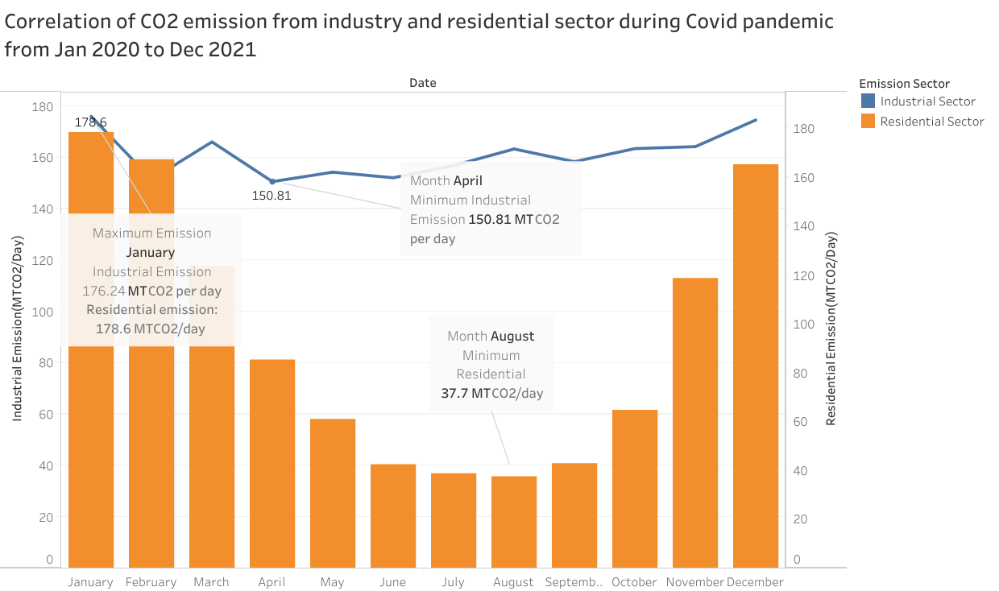

HW 7  Project - Initial Dataset Exploration
================
Vikas Chhillar

CS 625, Spring 2023

## Software used for this assignment.
   
For this Assignment, I used **Tableau online** for creating visualization.
and **excel software** for viewing and filtering, sorted the data.

## STEP 1.

### About Data 

**COVID-19** is an infectious disease caused by the **SARS-CoV-2 virus**. It affects the human respiratory system, making breathing difficult. It’s a contagious disease that has spread across the world like wildfire. The virus was initially discovered in **Wuhan, China, in 2019**. The pandemic has affected millions of people worldwide, who are either sick or have died due to the spread of this disease    
COVID-19 has affected people’s lives in many ways, from social distancing to lockdowns and quarantines. It has also affected the **global economy and stock market and even change the way people communicate**. By comparing COVID-19 datasets with other datasets related to global economic data or air quality index data, you can gain insights into how COVID-19 has affected these areas.    

Due to the significant impact of COVID-19 on every aspect of human society, there are many sectors that have been completely disrupted. As a result, COVID-19 historical data is an excellent dataset for visualizing the changes in different aspects of society.    

For the **initial exploration**, I have selected the **Coronavirus (COVID-19) Data in the United States from the New York Times repository (https://github.com/nytimes/covid-19-data)**. 

For the **secondary dataset**, I aim to use the commute data of the people in the United States to analyze how their commute patterns changed during the COVID-19 pandemic. However, finding the exact data that I need was challenging. After extensive searching, I decided to use the carbon dioxide emission data as a proxy for the commute data. This data can provide me with the CO2 emissions from ground and aviation transport in the US, which can reflect the changes in travel behavior and mode choice during the pandemic. The measurement used for Co2 emission is **MtCO2 per day**.    
**MtCO2** per day is a unit of measurement for CO2 emission that stands for megatons of CO2 per day. One megaton is equal to one million metric tons, and one metric ton is equal to 1,000 kilograms. Therefore, one MtCO2 per day is equal to 1,000,000,000 kilograms of CO2 emitted per day. This unit is often used to express large-scale CO2 emissions from different sources or sectors, such as industry, transportation etc.    
Here is the link the secondary dataset I am using in this project **Secondary dataset (https://carbonmonitor.org/)**

## Secondary Dataset
Dataset Selected :  Secondary dataset (https://carbonmonitor.org/)
---    

This dataset contains **48181 rows and 4 columns.**     

There are 6 different sector in the dataset. 
- Domestic aviation
- International Aviation
- ground transport
- Residential
- Industry
- Power
  
    
   

## Step 2: Start the EDA Process
**Exploratory Data Analysis (EDA)** is an important step in any data analysis or data science project. EDA is the process of **investigating the dataset to discover patterns and anomalies (outliers) and form hypotheses based on our understanding of the dataset**. EDA involves generating summary statistics for numerical data in the dataset and creating various graphical representations to understand the data better. The goal of EDA is to maximize insights into a dataset.Exploratory data analysis (EDA) is a process of examining and summarizing data sets using various techniques such as descriptive statistics, graphical displays, and interactive tools. EDA helps to identify patterns, trends, outliers, and relationships in the data, as well as to generate hypotheses and questions for further analysis. EDA is an iterative and creative processes that require careful planning, execution, and evaluation.    
First thing i did is **I freeze the title pane of my dataset’s first row containing the names of all columns. This way, I can still keep track of the title of my column while scrolling through the dataset**.     
Also data is described as statewise. and I found that in US column with respect to date  is actually the total sum of all state emmission togetheer on that date.. So I used US column. For the reference  I used **January 1st 2020 date**  to show this analysis.
 
 
        

 After analyzing the data, I determined that for the **visualization**, 
 Also I took my maindata file from HW6 containing data of covid cases and death case and added these carbon emission data with them for the corerelation and visualization.         
 
 
           
 
 
  We need 4 sector for this visualization.   
- Domestic aviation
- ground transport
- Residential
- Industry    
     
     
 So I filtered these 4 sector from the dataset in two different csv files.
 - CO2 emission with resident and industrial sector      
  

            

- CO2 emission from AViation and ground transport sector          

       

     

- Date ( From 1st january 2020 to 31st december 2021 ) 
- Domestic Aviation CO2 emmission per day. - we are using domestic aviation because international avaiation does not correlate with USA ground transport data.
- Ground transport CO2emmission per day            

Now the first question that comes to mind is:     

**Q1. On which month carbon emission is maximum in aviation and ground transport sector ?**    

   Month with maximum  Emission for ground transport sector is August 2021 = 140.51 MTCO2 / day      
   Month with maximum  Emission for Aviation sector is December 2021 = 15.139 MTCO2 / day 

Because the dataset is quite big, I converted the **date into months in Tableau** for better visualization.    
       
 **Q2. On which month carbon emission is minimum in aviation and ground transport sector ?**       
 
   
   Month with minimum  Emission for ground transport is April 2020 = 94.24 MTCO2 / day     
    
   Month with minimum  Emission for Aviation sector is April 2020 = 5.548 MTCO2 / day      
    
     

        
        
### Q3. Is there any month when industrial carbon emission is less than residential emission?

   Yes, In february month residential carbon emission is more than industrial emission.

    
    
### Final two questions are 

## 1. Is there a change in  CO2 emission from way of commute (aviation and ground transport ) in US during the COVID-19 pandemic? **

 

 
### Creating Visualization in Tableau 
---    
- Downloaded the **maindata.csv** file for visualization purposes.
- Converted the **date into months** to improve visualization.
- **Summarized the date into months** in the visualization to obtain the total number of emission by aviation sector and ground transport sector of complete dataset in a **specific month**.
- Annotated the marks with the highest and lowest value and matched the annotation color with the charts.
- Used **dual axis** for better visualization and repeated the steps done before.
- Used **line charts** for Aviation emission / month.
- Used **bar charts** for Ground transport emission / month.
- Annotated the **marks** with matching color of the chart.
- Labeled the **X and Y axis**.
- Wrote a **title and subtitle** for the visualization.
- Used **circle to define total covid cases per month**
- Used size in mark circle to define Covid Death per month
    
    
 
    
    
#### Observation
---
Based on the data analysis, I can infer that the CO2 emissions from aviation and ground transport decreased significantly during the first wave of the COVID-19 pandemic. The ground transport emissions started to recover gradually, but the aviation emissions remained low compared to the ground transport emissions. A possible explanation for this pattern is that people were afraid of getting infected by the virus, so they avoided traveling by air where the risk of exposure was higher than traveling by personal car. Therefore, the domestic aviation CO2 emissions were low for several months. However, after the second wave of the pandemic in January 2021, both sectors experienced another drop in emissions, followed by a quick rebound in the next two months. This could be attributed to the increased vaccination rates and reduced fear among people, which encouraged them to resume their travel activities.

## 2. Is there a correlation between change in carbon emission from industry and residential sectors  during covid 19 in the US?   

 

### Creating Visualization in Tableau 
---   

- Downloaded the **resind.csv** file for visualization purposes.
- Converted the **date into months** to improve visualization.
- Used **months** data on the **x-axis** to make visualization feasible because date data is very large.
- Used **bar charts to visualize Residential emission** from Jan 2020 to  Dec 2021.
- Used **bar charts to visualize Industrial emission** from Jan 2020 to  Dec 2021.
- **Annotated** the marks with the month with maximum emission in both sector (residential and industrial). 
- **Annotated** the marks with the month with minimum emission in both sector (residential and industrial).
- Defined the **legends ( Sector)**.
- Now in Second chart used **dual axis** for better visualization and repeated the steps done before.
- Used **line charts** for emission in industrial sector.
- Used **bar charts** for emission in residential sector.
- Labeled the **X and Y axis**.
- Wrote a **title ** for the visualization.
- Defined the **legends (Emission Sector)**.

 
#### Observation
---  
The visualization shows that the CO2 emissions from industries decreased slightly during the first wave of the COVID-19 pandemic, but remained relatively stable throughout the period. However, the CO2 emissions from residential sector declined sharply during the first wave, and then increased again in the following months. This pattern may seem counterintuitive, as one would expect more residential emissions when people stay at home due to the pandemic. However, I found that COVID-19 is not the only factor affecting residential emissions. Another important factor is the weather and the seasonal cycle. Residential CO2 emissions are higher in winter than in summer, because of the higher demand for heating and electricity. The CO2 emissions also depend on the type of fuel used for electricity generation, such as coal, natural gas, or renewables. Moreover, residential CO2 emissions are influenced by the plant growth and decay cycle, as plants absorb CO2 from the atmosphere in summer and release it back in winter. Therefore, residential CO2 emissions vary with the seasons and the climate conditions. Thus, we cannot attribute the decline in residential emissions solely to COVID-19.

---     
## References

-   [1](https://github.com/nytimes/covid-19-data)
-   [2](https://coronavirus.jhu.edu/)
-   [3](https://www.cdc.gov/)
-   [4](https://www.who.int/health-topics/coronavirus#tab=tab_1)
-   [5](https://www.youtube.com/shorts/VzYdVbFT3aY)
-   [6](https://carbonmonitor.org/)
-   [7](https://www.youtube.com/shorts/VzYdVbFT3aY)
-   [8](https://www.theguardian.com/world/2022/jun/14/people-who-caught-covid-in-first-wave-get-no-immune-boost-from-omicron)
-   [9](https://help.tableau.com/current/online/en-us/web_author.htm?source=productlink)
-   [10](https://www.youtube.com/watch?v=z4mLwELziNg)
