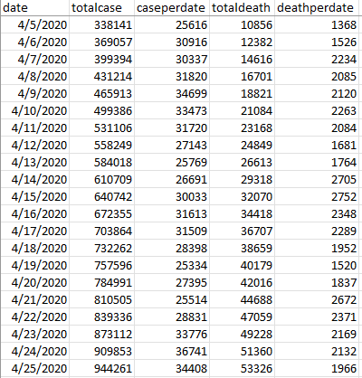
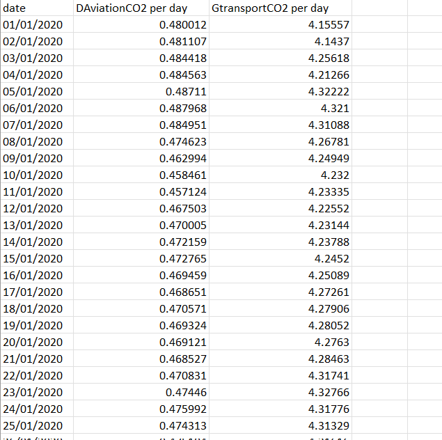
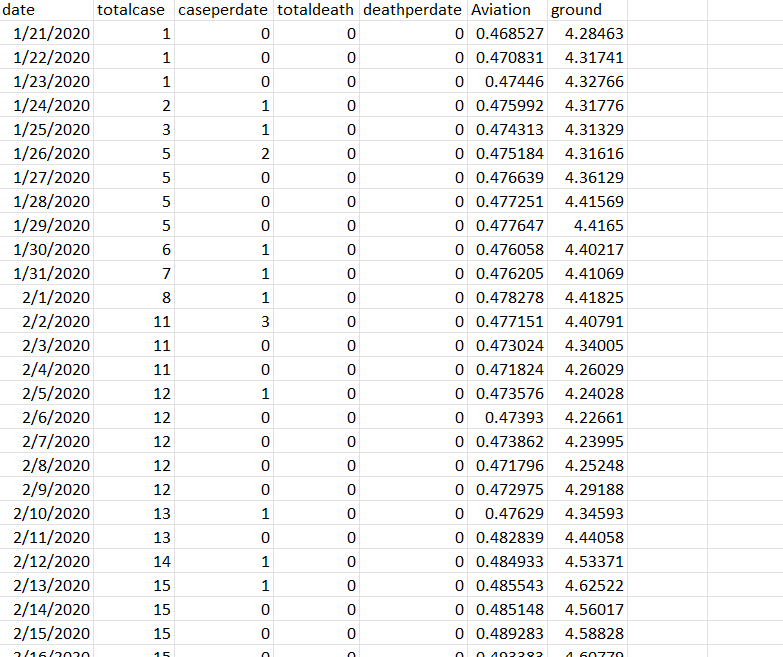
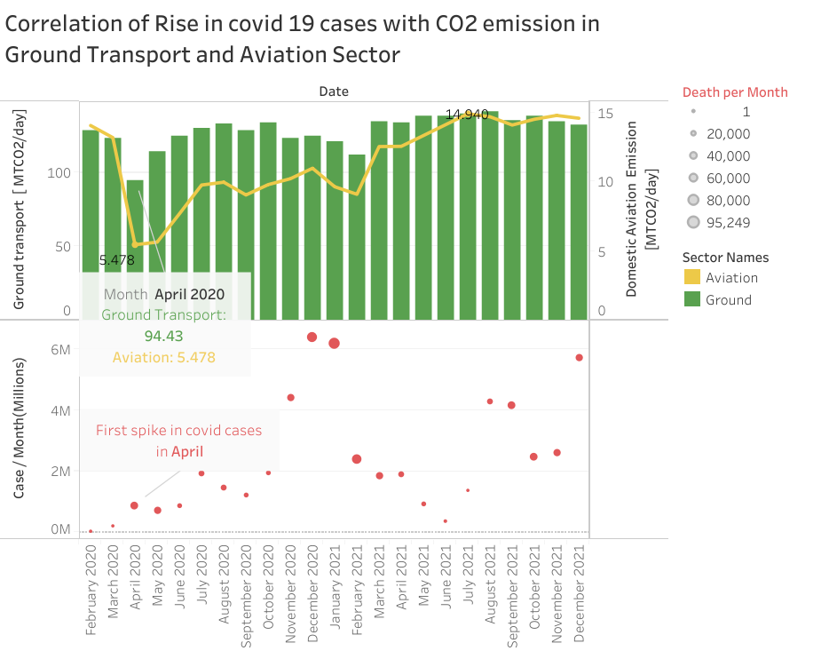
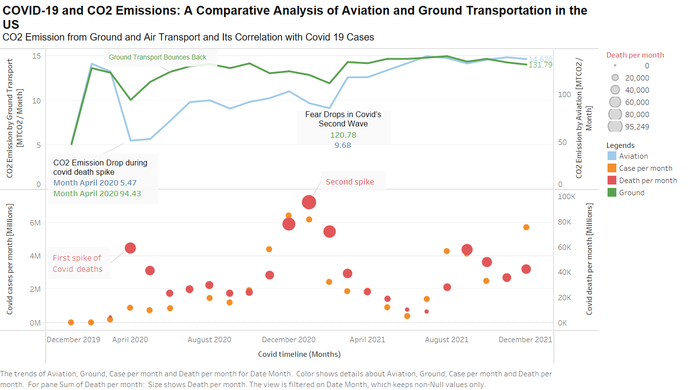

HW 8  Project - Implement Final Chart
================
Vikas Chhillar 

CS 625, Spring 2023

## COVID-19 and CO2 Emissions: A Comparative Analysis of Aviation and Ground Transportation in the US
    
The COVID-19 pandemic has had a profound impact on the transportation sector in the United States, affecting both the demand and supply of various modes of travel. Among them, aviation and ground transportation are two important modes that serve different purposes and markets, but also have significant environmental implications. Comparing the changes in these two modes of travel during the pandemic can provide valuable insights into their relative advantages and disadvantages, as well as their potential for reducing greenhouse gas emissions and improving air quality. This study aims to conduct a comparative analysis of aviation and ground transportation in the United States during the COVID-19 pandemic, using data from various sources and methods.  

## Software used for this assignment.
   
For this Assignment, I used **Tableau online** for creating visualization.
and **excel software** for viewing and filtering, sorted the data.

## STEP 1.

###  Brief description of your chosen datasets

#### Main Dataset

**COVID-19** is an infectious disease caused by the **SARS-CoV-2 virus**. It affects the human respiratory system, making breathing difficult. It’s a contagious disease that has spread across the world like wildfire. The virus was initially discovered in **Wuhan, China, in 2019**. The pandemic has affected millions of people worldwide, who are either sick or have died due to the spread of this disease    
COVID-19 has affected people’s lives in many ways, from social distancing to lockdowns and quarantines. It has also affected the **global economy and stock market and even change the way people communicate**. By comparing COVID-19 datasets with other datasets related to global economic data or air quality index data, you can gain insights into how COVID-19 has affected these areas.    

Due to the significant impact of COVID-19 on every aspect of human society, there are many sectors that have been completely disrupted. As a result, COVID-19 historical data is an excellent dataset for visualizing the changes in different aspects of society.    

For the **initial exploration**, I have selected the **Coronavirus (COVID-19) Data in the United States from the New York Times repository (https://github.com/nytimes/covid-19-data)**. 
   

This dataset contains **1159 rows and 3 columns.** 
- Date ( From 21st january 2020 to 23rd january 2023 ) 
- Cases (Total number of cases)
- Death. (Total number of death)      

While analyzing the dataset, I found some negative values such as -2435 which appear to be mistakes in the dataset. these errors are visible in the negative side of X axis in the visualization. Upon further investigation, I found that there were errors in four rows, specifically rows 502, 785, 993, and 1148.
          

#### Secondary Dataset

For the **secondary dataset**, I aim to use the commute data of the people in the United States to analyze how their commute patterns changed during the COVID-19 pandemic. However, finding the exact data that I need was challenging. After extensive searching, I decided to use the carbon dioxide emission data as a proxy for the commute data. This data can provide me with the CO2 emissions from ground and aviation transport in the US, which can reflect the changes in travel behavior and mode choice during the pandemic. The measurement used for Co2 emission is **MtCO2 per day**.    
**MtCO2** per day is a unit of measurement for CO2 emission that stands for megatons of CO2 per day. One megaton is equal to one million metric tons, and one metric ton is equal to 1,000 kilograms. Therefore, one MtCO2 per day is equal to 1,000,000,000 kilograms of CO2 emitted per day. This unit is often used to express large-scale CO2 emissions from different sources or sectors, such as industry, transportation etc.    

Dataset Selected :  Secondary dataset (https://carbonmonitor.org/)
---    

This dataset contains **48181 rows and 4 columns.**     

There are 6 different sector in the dataset. 
- Domestic aviation
- International Aviation
- ground transport
- Residential
- Industry
- Power
  
   
   
First thing i did is **I freeze the title pane of my dataset’s first row containing the names of all columns. This way, I can still keep track of the title of my column while scrolling through the dataset**.     
Also data is described as statewise. and I found that in US column with respect to date  is actually the total sum of all state emmission togetheer on that date. So I used US column. For the reference  I used **January 1st 2020 date**  to show this analysis.
 
 
We need 2 sector for this visualization.   
- Domestic aviation
- ground transport 
     
       

- Date ( From 1st january 2020 to 31st december 2021 ) 
- Domestic Aviation CO2 emmission per day. - we are using domestic aviation because international aviation does not correlate with USA ground transport data.
- Ground transport CO2emmission per day          

## Combined dataset
        
To create the visualization, I analyzed the data and found that I can merge this data with the previous covid data for the further visualization. For that I sorted the date column with respect to the CO2 emission data and covid data to examine the correlation and visualize the results. 
 
     
 
 ### Image of your selected draft chart from HW7           

      

### Final question from HW7 that will be addressing  

**COVID-19 and CO2 Emissions: A Comparative Analysis of Aviation and Ground Transportation in the US**    

 
### Refining the draft chart. 

- I conducted multiple correlation analyses between ground transportation / aviation transportation and COVID-19 cases / COVID-19 deaths.
- I used insights from both the COVID-19 dataset and the carbon emission dataset for this visualization.
- I used the line chart to show the correlation between COVID-19 cases and COVID-19 deaths, as well as the commute pattern of both ground and aviation sectors.
- I used the color channel to distinguish between two commute groups and also between COVID-19 cases and deaths.
- I provided legends for clarity.
- I used contrasting colors with high intensity for the visualization.
- I used shape to highlight the change in COVID-19 deaths over time to make it easy to see the increase in the death rate during COVID-19.
- I labelled the axes and started them with 0 and the values on the axes are evenly distributed.

##  visualization principles    
- One of the basic principles is to be clear on our purpose. What do we want to show the audience? Here I wanted to show the relationship for both ground transportation / aviation and COVID-19 cases / deaths.
- Data cleaning is needed for some datasets to show the exploratory data analysis.
- Choosing the right graph, we should have a clear idea on idioms which idiom is appropriate for what analysis. I have used the scatter plot and line chart to show the relationship.
- Make sure where the audience focuses their attention, one is the title should attract and the other is the colors that we are using to display the graph.
- Don’t make the graphs too complex with different designs and patterns.

## Headline fits the chart     

**COVID-19 and CO2 Emissions: A Comparative Analysis of Aviation and Ground Transportation in the US**
I have given this headline because I think this line will justify the visualization and it can create curiosity among viewers to learn more about this dataset and the visualization.

## Idiom used is scatterplot and linechart

The ground transportation and aviation sectors have different scales of values. If one examines the dataset, it is evident that the scale changes throughout the dataset. Comparing values of such a high scale with some other chart is not quite appropriate. Hence, I used this idiom to see the specifics of the correlation and also the numerical analysis of the data. The basic questions from the dataset, which I presented in the preliminary analysis, can be solved with the numerical data, but the real insights can only emerge by the correlation between various data. The best idiom to use for analyzing correlation is the scatterplot, where the spatial position, which is a very efficient channel, is used to represent the dataset with all numerical attributes. It is excellent for finding patterns, outliers, distribution and correlation, and many items up to 100 items can be visualized using the scatterplot effectively. This is why I selected scatterplot as the final chart’s idiom.    
The line chart is another idiom that I used to visualize the data. The line chart uses the spatial position and the length, which are both very effective channels, to represent the dataset with two quantitative attributes. It is great for showing the change over time, the trend, the slope and the rate of change of the data. It can also compare multiple series of data and show the relationship between them. This is why I used line chart to show the variation of the data over time and across different modes of transportation.

  ## Steps    
  
- Downloaded the **maindata.csv** file for visualization purposes.
- Converted the **date into months** to improve visualization.
- **Summarized the date into months** in the visualization to obtain the total number of emission by aviation sector and ground transport sector of complete dataset in a **specific month**.
- Annotated the marks with the highest and lowest value and matched the annotation color with the charts.
- Used **dual axis** for better visualization and repeated the steps done before.
- Used **line charts** for Aviation emission / month.
- Used **line charts** for Ground transport emission / month.
- Annotated the **marks** with matching color of the chart.
- Labeled the **X and Y axis**.
- Wrote a **title ** for the visualization.
- Used **circle to define total covid cases per month**
 
    
    

### Image of  refined chart

 

## Explanation of how your final chart answers the question you asked in HW7:     

The data analysis reveals that the CO2 emissions from aviation and ground transport experienced a significant decline during the first wave of the COVID-19 pandemic. The ground transport emissions began to recover gradually, but the aviation emissions stayed low compared to the ground transport emissions. A plausible explanation for this pattern is that people were concerned about getting infected by the virus, so they refrained from traveling by air where the risk of exposure was higher than traveling by personal car. As a result, the domestic aviation CO2 emissions were low for several months. However, after the second wave of the pandemic in January 2021, both sectors witnessed another drop in emissions, followed by a rapid rebound in the next two months. This could be attributed to the increased vaccination rates and reduced fear among people, which motivated them to resume their travel activities.

    
    
#### Final thought

For this report, I spent less time than the first two assignments related to this project, as the first two assignments involved a lot of thinking about what kind of data exploration to do. The EDA process really helped a lot in selecting the appropriate datasets and in examining each chart individually and together, which really gave me some good insight into the data I was working with. I had to revise some parts of the previous two assignments as some of the datasets were not adequate or did not have the data features that I wanted and because of this, this process really helped me become a more proficient data detective. This project work gave me a valuable opportunity to delve into EDA and understand more complex data analysis.

I strongly believe that dividing this project into three assignments really assisted me with managing my time well and served as a great guide in to learning a great EDA method. I would have certainly found it very overwhelming rather than challenging if it had been a single project. The three assignments helped me to break down the project into manageable steps and to focus on each aspect of the EDA process. They also helped me to research along the way, which improved my understanding and skills. I think this was a very effective way of learning how to conduct a comprehensive and rigorous EDA.

  
## References

-   [1](https://carbonmonitor.org/)
-   [2](https://coronavirus.jhu.edu/)
-   [3](https://www.youtube.com/watch?v=z4mLwELziNg)
-   [4](https://www.who.int/health-topics/coronavirus#tab=tab_1)
-   [5](https://www.youtube.com/shorts/VzYdVbFT3aY)
-   [6](https://www.theguardian.com/world/2022/jun/14/people-who-caught-covid-in-first-wave-get-no-immune-boost-from-omicron)
-   [7](https://www.youtube.com/shorts/VzYdVbFT3aY)
-   [8](https://github.com/nytimes/covid-19-data)
-   [9](https://help.tableau.com/current/online/en-us/web_author.htm?source=productlink)
-   [10](https://www.cdc.gov/)
