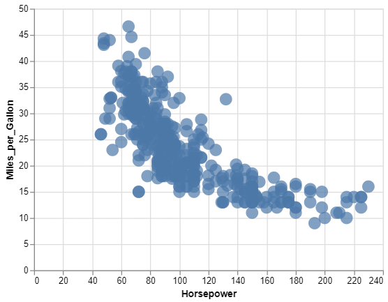
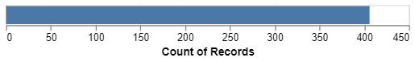

HW 1, CS 625, Spring 2023
================
Vikas Chhillar
Jan 19, 2023

## Git, GitHub

1.  *What is your GitHub username?*

vikas2020

2.  *What is the URL of your remote GitHub repo (created through
    Mr. Kennedy’s exercises)?* `git@github.com:vikas2020/cs625.git`

## R

The command below will load the tidyverse package. If you have installed
R, RStudio, and the tidyverse package, it should display a list of
loaded packages and their versions.

``` r
library(tidyverse)
```

    ## ── Attaching packages ─────────────────────────────────────── tidyverse 1.3.2 ──
    ## ✔ ggplot2 3.4.0      ✔ purrr   1.0.1 
    ## ✔ tibble  3.1.8      ✔ dplyr   1.0.10
    ## ✔ tidyr   1.2.1      ✔ stringr 1.5.0 
    ## ✔ readr   2.1.3      ✔ forcats 0.5.2 
    ## ── Conflicts ────────────────────────────────────────── tidyverse_conflicts() ──
    ## ✖ dplyr::filter() masks stats::filter()
    ## ✖ dplyr::lag()    masks stats::lag()

## R Markdown

1.  *Create a bulleted list with at least 3 items*

- python
- data mining
- NLP
- Data visualization

2.  *Write a single paragraph that demonstrates the use of italics,
    bold, bold italics, code, and includes a link. The paragraph does
    not have to make sense.*

Check out our *new stylish* font in the **generator** and ***level up
your social*** bios. Need`<html>` Glyphy for all the fancy fonts and
cool symbols you could ever imagine.here is google
[link](https://www.google.com/),to further search.

3.  *Create a level 3 heading*

### here is the level 3 heading

## R

#### Data Visualization Exercises

1.  (Q2) *How many rows are in mpg? How many columns?*

    ggplot2::mpg

    There are 234 rows and 11 column

2.  (Q4) *Make a scatterplot of hwy vs cyl.*

ggplot(data = mpg) + geom_point(mapping = aes(x = hwy, y = cyl))


#### Workflow: basics Exercises

1.  (Q2) *Tweak each of the following R commands so that they run
    correctly (`library(tidyverse)` is correct):*

``` r
library(tidyverse)
ggplot(data = mpg) + 
  geom_point(mapping = aes(x = displ, y = hwy))
  
  (data is mispelt as dota)

filter(mpg, cyl = 8)

(filter is mispelt and == should be used in place of =)

filter(diamonds, carat > 3)
(diamonds is predefined instead of diamond )
```

## Google Colab

1.  *What are the URLs of your Google Colab notebooks (both Python and
    R)?*

[Google colab with
python](https://colab.research.google.com/drive/1_s2xcx_PxjDrjcfyHlb_gCufFpBYipca?usp=sharing)

[Google colab with
R](https://colab.research.google.com/drive/1tWi3_wKnryHUR0NA4iMC2wo856_PO_1q?usp=sharing)

## Tableau

*Insert your the image of your final bar chart here*


1.  *What conclusions can you draw from the chart?*

Sales of table(furniture) has positive profit of 554 in 2021 in the west
region. And in all other 3 regions profit is negative for table.

## Observable and Vega-Lite

### A Taste of Observable

1.  *In the “New York City weather forecast” section, try replacing
    `Forecast: detailedForecast` with `Forecast: shortForecast`. Then
    press the blue play button or use Shift-Return to run your change.
    What happens?*

    The detailed forecast is **Rain likely. Cloudy, with a high near 49.
    Chance of precipitation is 60%.** After changing into shortForcast,
    it is converted to **Light Rain Likely**

2.  *Under the scatterplot of temperature vs. name, try replacing
    `markCircle()` with `markSquare()`. Then press the blue play button
    or use Shift-Return to run your change. What happens? How about
    `markPoint()`?*

After pressing `markSquare()`the circle converted to square in the plot


1.  *Under “Pick a location, see the weather forecast”, pick a location
    on the map. Where was the point you picked near?* Blue ridge shores
    VA is the point picked on the map.

2.  *The last visualization on this page is a “fancy” weather chart
    embedded from another notebook. Click on the 3 dots next to that
    chart and choose ‘Download PNG’. Insert the PNG into your report.*
    

### Charting with Vega-Lite

`markCircle()`

1.  *Pass an option of `{ size: 200 }` to `markCircle()`.*

The size of circle increases 

1.  *Try `markSquare` instead of `markCircle`.*


1.  *Try `markPoint({ shape: 'diamond' })`.*


`vl.x().fieldQ("Horsepower")`, …

1.  *Change `Horsepower` to `Acceleration`*


1.  *Swap what fields are displayed on the x- and y-axis*


`vl.tooltip().fieldN("Name")`

1.  *Change `Name` to `Origin`.*


Another example, `count()`

1.  *Remove the `vl.y().fieldN("Origin")` line.*



1.  *Replace `count()` with `average("Miles_per_Gallon")`.*


## References

*Every report must list the references that you consulted while
completing the assignment. If you consulted a webpage, you must include
the URL.*

- Insert Reference
  [1](https://git.cs.odu.edu/tkennedy/git-workshop/-/wikis/Git-Workshop)
- Insert Reference
  [2](https://rmarkdown.rstudio.com/docs/articles/rmarkdown.html#tutorials%20https://www.example.com/reallyreallyreally-extra-long-URI/)
- Insert Reference
  [3](https://help.tableau.com/current/guides/get-started-tutorial/en-us/get-started-tutorial-home.html)
